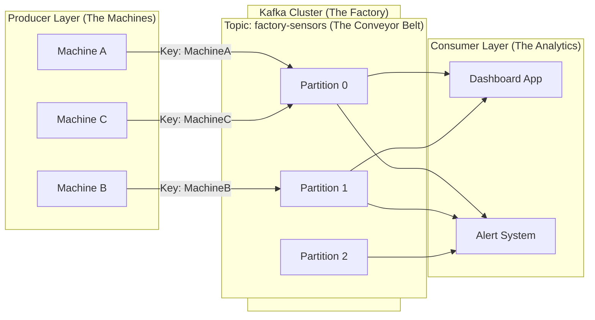

# Kafka Fundamentals: The Factory Analogy

Apache Kafka is a distributed event streaming platform. To understand it intuitively, let's visualize it as a massive, high-tech **Factory**.

## The Concepts

### 1. The Factory (The Cluster)
Imagine a huge factory floor. This is your **Kafka Cluster**.
Inside this factory, you have several "Warehouse Managers" who coordinate everything. These are your **Brokers**.
- In a small factory (local development), you might have just 1 Manager (Broker).
- In a mega-factory (production), you have 3, 5, or more Managers working together to ensure nothing gets lost if one goes on a coffee break (High Availability).

### 2. The Production Lines (Topics)
The factory receives different types of raw materials. You don't throw everything into one big pile. You have specific conveyor belts for specific items.
These conveyor belts are your **Topics**.

- **Topic "Machine-Logs"**: Conveyor belt for error logs.
- **Topic "Sensor-Data"**: Conveyor belt for telemetry (temperature, speed).

### 3. The Lanes (Partitions)
If a conveyor belt (Topic) moves too slowly, the machines feeding it have to stop. To make it faster, you split the belt into multiple parallel **Lanes**.
These lanes are **Partitions**.
- More lanes = More data can move at the same time (Higher Throughput).
- A topic is just a logical collection of these partitions.

---

## Scenario: The Smart Factory

Let's design a Kafka system for a factory with hundreds of industrial machines.

**The Setup:**
- **Producers**: The Industrial Machines (Machine A, Machine B).
- **Data**: Sensors on these machines (Temperature, Vibration, Oil Pressure).

### Visualizing the Flow



### Design Best Practices

#### 1. Partitions & Ordering
**Rule of Thumb**: Kafka guarantees order *only* within a single Partition, not across the whole Topic.

**Scenario**: Machine A sends:
1. `Temperature: 50°C`
2. `Temperature: 80°C` (Overheat!)
3. `Temperature: 20°C` (Shutdown)

If these messages land in different partitions, the Consumer might read them as 1 -> 3 -> 2. You would see the machine shut down *before* it overheats!

**Solution**: Use the **Machine ID as the Key**.
- All messages with Key `MachineA` will ALWAYS go to the same Partition (e.g., Partition 0).
- This guarantees that the Dashboard sees the events in the exact order they happened.

#### 2. Throughput vs. Complexity
- **More Partitions** = Higher parallelism. You can have more consumers reading at the same time.
- **Too Many Partitions** = More open files and higher latency for replication.
- **Advice**: Start with a reasonable number (e.g., 3 or 6) and scale up if the "conveyor belt" becomes the bottleneck.

### Example Configuration

For our factory, a robust configuration would be:

```yaml
# Topic Configuration
topic: factory-sensors
partitions: 6              # Allow up to 6 consumers to read in parallel
replication_factor: 3      # Data is copied to 3 managers (Brokers) for safety

# Producer Configuration
acks: all                  # Don't continue until the Manager confirms receipt
compression.type: snappy   # Compress data to save bandwidth on the belt
key.serializer: String     # Use MachineID string as the routing key
```

---

## Summary

| Kafka Concept | Factory Analogy | Purpose |
|:---|:---|:---|
| **Cluster** | The Factory | The infrastructure holding everything together. |
| **Broker** | Warehouse Manager | Server handling data storage and retrieval. |
| **Topic** | Conveyor Belt | Category or feed name for messages. |
| **Partition** | Parallel Lane | Unit of parallelism and scalability. |
| **Producer** | Machine | Source of data (sends messages). |
| **Consumer** | Inspector | Destination of data (reads messages). |
| **Key** | Routing Label | Determines which lane (Partition) a message goes to. |

Use this mental model when designing your pipelines. If your "Conveyor Belt" is slow, add more "Lanes" (Partitions). If you need order, label your boxes (Keys) correctly!
